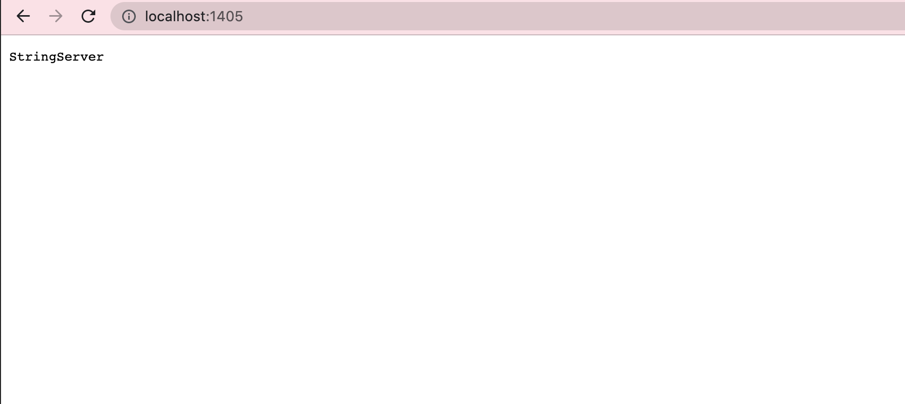
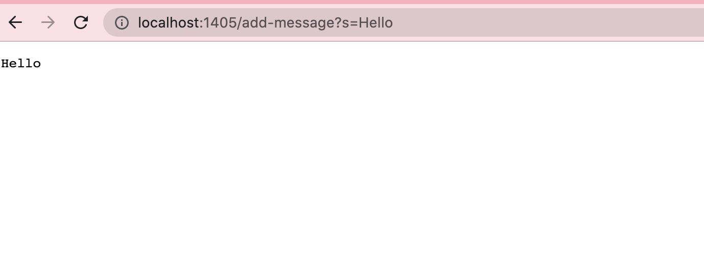
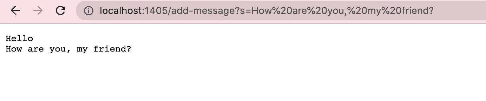
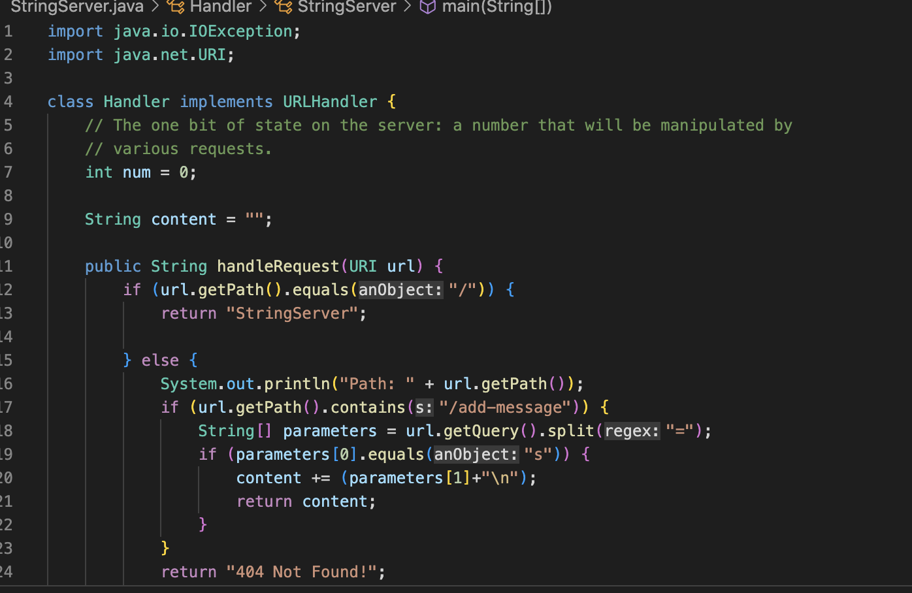
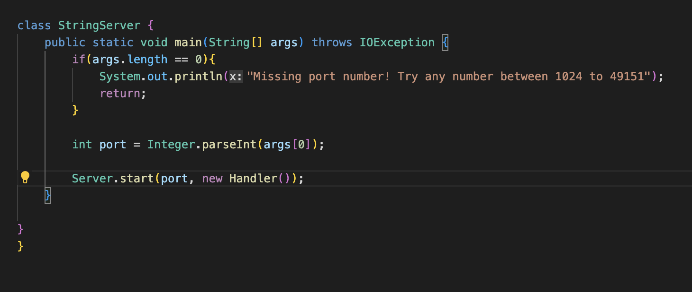
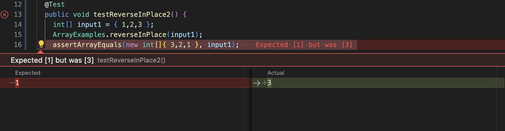

CSE15L Lab Report 2
=====


# __Part 1__

__StringServer__

__Working StringServer__





__String Server Code__





The 2 methods in my code are `handleRequest()` in the Handler class and a main method in the StringServer class. The main method creates a web server by
c using the `Server.java` and inputting an instance of Handler along with the user inputted port number. The `Server.java` file calls the `handleRequest()` method.
The handleRequest method takes in a url as a parameter. First, I have a if statement if there is an empty path to return "StringServer".
If the path is not empty, the else statement checks if url contains `/add-message`. Then the code splits the remaining part of path after `?` into an array of strings.
The first string is `"s"` and second string in the array is the content to be added to server. I created a string variable called content and 
the second string is appended along with a new line character.


# __Part 2__


__reverseInPlace()__

1) __Failure Inducing Input__ - {1,2,3}

expected output: {3,2,1}  actual output: {3,2,3}
```
  @Test
  public void testReverseInPlace2() {
    int[] input1 = { 1,2,3 };
    ArrayExamples.reverseInPlace(input1);
    assertArrayEquals(new int[]{ 3,2,1 }, input1);
	}

```

2) __Successful Input__  - {1,1,1}

expected output: {1,1,1}  actual output: {1,1,1}

```
@Test 
public void testReverseInPlace() {
    int[] input1 = { 1,1,1 };
    ArrayExamples.reverseInPlace(input1);
    assertArrayEquals(new int[]{ 1,1,1 }, input1);
	}
```


3) __Symptom__ - Incorrect Output, output is not reversed version of input




4) __Bug__ - The loop should run only length/2 times and should be assigning `arr[arr.length-i-1]` to the original value of `a[i]`.
The output of the test has 3 as the last value instead of the expected 1 because once the loop gets to index arr.length-1, arr[i] index has alreadly lost its original value being assigned to the value at index arr.length-1 previously in the loop. This motivates my bug fix since I simultaneously assign arr[i] ot arr[arr.length-i-1]'s value and arr[arr.length-i-1] to arr[i]'s value. Since I am changing the array from two directions, the loop only needs run half the length.

Code before bug fixed
```
static void reverseInPlace(int[] arr) {
    for(int i = 0; i < arr.length; i += 1) {
      arr[i] = arr[arr.length - i - 1];
    }

```


Code after bug fixed 
```
 static void reverseInPlace(int[] arr) {
    for(int i = 0; i < arr.length/2; i += 1) {
      int temp =arr[i];
      arr[i] = arr[arr.length - i - 1];
      arr[arr.length - i - 1] = temp;
    }
  }

```
The fix here solves the bug because it saves copy of the original value of `arr[i]` and assigned to it `arr[arr.length - i - 1] = temp` and the loop only
runs half the length of `arr`. This ensures the array is correctly reversed.
# __Part 3__

In week 2, I learned how URL paths are parsed by webservers to change output on webpage. In week 3, I learned to distinguish the particular terminology
around programming errors such as bugs, symptoms, failure inducing inputs.


