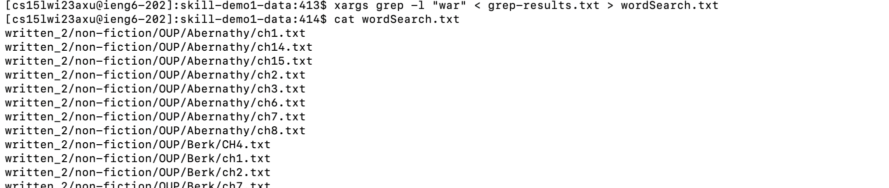
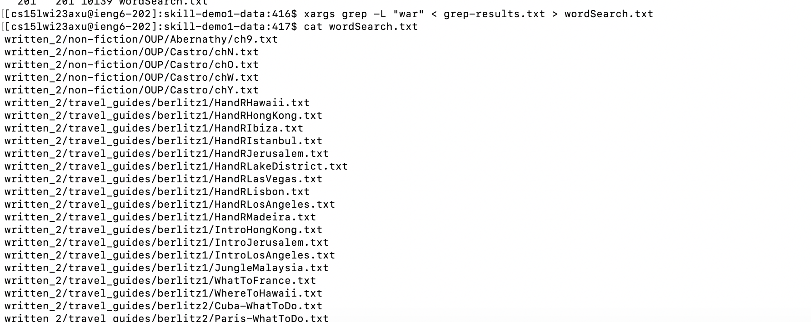
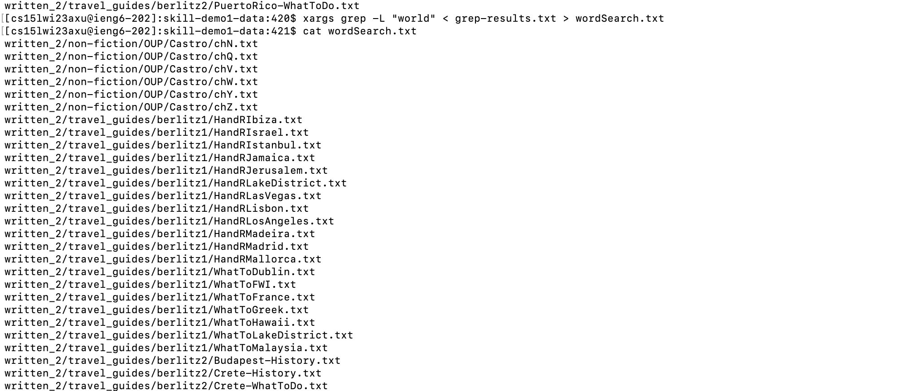
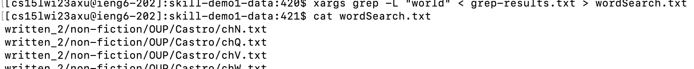
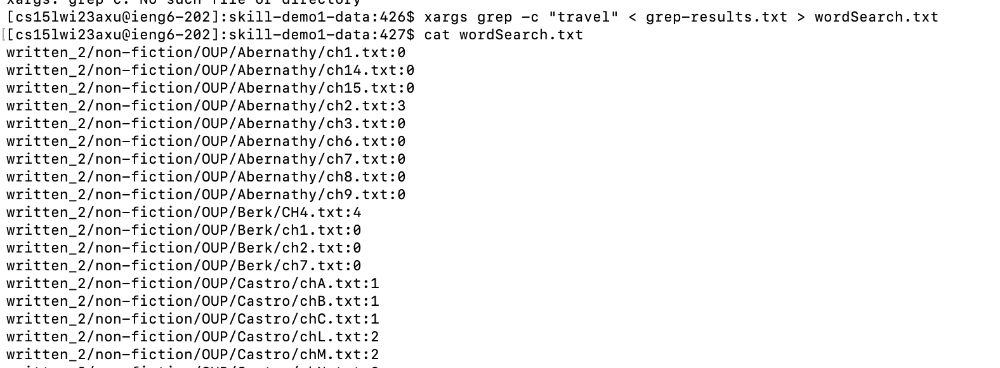
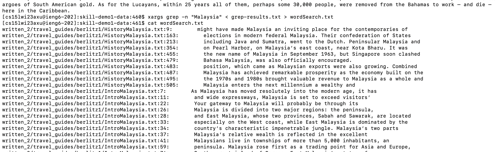
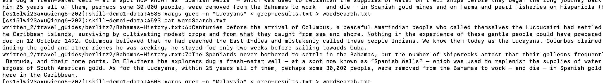

grep options 

source: https://man7.org/linux/man-pages/man1/grep.1.html

1. -l - files with match 

2. -L - files without match 

3. -c - count number of matching lines in input file

4. -n -  each line of output contains line number of each line containing string

