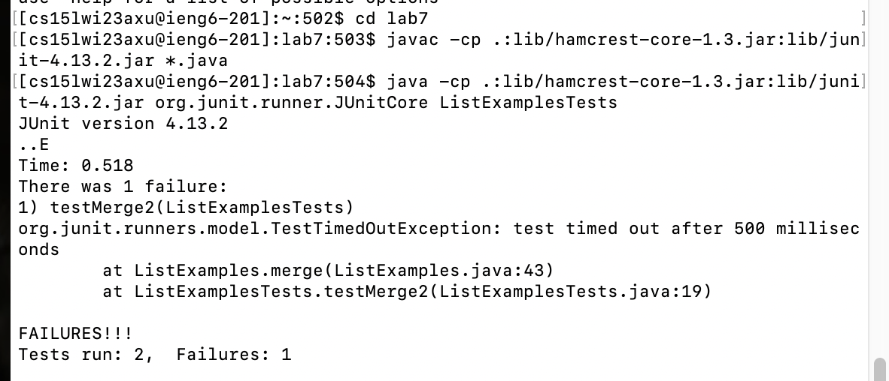
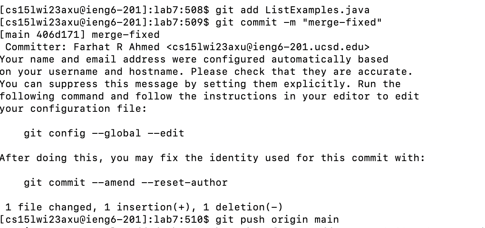

# My Exact Process in Complete Lab 7's Task

## 1. Deleting prexisting lab7 repository

I went to the settings option on the github page of lab7 and scrolled down all the way to bottom. There, I cliked
on "Delete this repository" in the "Danger Zone"

## 2. Forking Lab7 Repo

I went to week 7 page on the cse15l github webpage and clicked on the link, "the lab7 repo." There I clicked on fork in the top right corner to fork it to my github.

## 3. Loging In

Then I opened my terminal. I typed "ssh" and then up arrowed twice <up><up> to my username "cse15lwi23axu@ieng6.ucsd.edu"

  
## 4. Forking Repository in Remote Machine
  
  I then typed "git clone" and went to my forked repository of lab7 and copied the ssh link and pasted it in terminal to fork the git repository on the remote machine.
  
 
 

## 5. Initially Running Tests
  
  I cd'd into lab7. 
  
  
    
  
  
  I used the up arrow to find the commands for compiling and testing the junit tests. For compiling it was <up><up><up><up><up> and for testing it was<up><up><up><up>.
The output shows that the test for merge failed.
  
  
   

## 6. Editing ListExamples 
  
 To edit the ListExamples file, I typed in nano List<tab>.java to open the nano editor with ListExamples.java file. 
  
     
  
  
  I used the shortcut C^W to find the merge method and use the down arrow
to move down to the final loop to change "index1" to "index2." 
  
     
  
     
  
  Then I used the shortcut C^O and pressed enter to save the file. 
  
    
  
  Lastly, I pressed the shortcut C^X to exit the nano editor.
  
   
  

## 7. Then I used <up><up><up> to compile and <up><up><up> to run the junit tests again. The output shows all tests pass.
 
    
   

## 8. To push to github, I first type in the command "git add Lis<tab>.java" to complete the command "git add ListExamples.java." To commit, I typed in the command
git commit -m "fixed-merge". Lastly, to push to github, I typed in the command "git push origin main."
  
    
   
