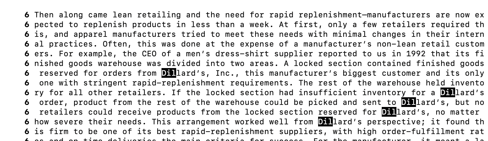

Options for less Command

source: https://man7.org/linux/man-pages/man1/less.1.html

 Less 

a. less -N
The -N option ensures the the less output shows line numbers which can be incredibly helpful in an especially large file to find specific lines.

Example1

__command:__
```
(base) nargisjareen@Nargiss-MacBook-Pro Abernathy % less -N ch7.txt

```

__output:__ 
```
     1 
      2 
      3 
      4 
      5 Retailers’ calls to apparel manufacturers about late delivery are the basis for many       
      5 a tall tale at retail conventions. In the past, the standard reply to a query about w      
      5 hat had happened to an order was “It’s on the loading dock.” Information systems at a      
      5 pparel factories were primitive. If all the SKUs for an order were not in the warehou      
      5 se, substitutions of the same style in a different size would be offered to the retai      
      5 ler. Or retailers might not even notice if an unplanned substitution had been made be      
      5 cause their information systems were equally as primitive. If there were insufficient      
      5  SKUs of the requested style, the order would be shorted or a phone call made to the       
      5 retail buyer to negotiate a solution to the problem. If no SKUs of the order were in       
      5 the finished goods warehouse, then the search of the factory floor—where there might       
      5 be tens of thousands of partially completed items to look through—would begin.
```
Example 2

__command:__
```
(base) nargisjareen@Nargiss-MacBook-Pro skill-demo1-data % less -N results.txt


```
__output:__ 
```

      1 written_2/
      2 written_2//non-fiction
      3 written_2//non-fiction/.DS_Store
      4 written_2//non-fiction/OUP
      5 written_2//non-fiction/OUP/Berk
      6 written_2//non-fiction/OUP/Berk/ch2.txt
      7 written_2//non-fiction/OUP/Berk/ch1.txt
      8 written_2//non-fiction/OUP/Berk/CH4.txt
      9 written_2//non-fiction/OUP/Berk/ch7.txt
     10 written_2//non-fiction/OUP/.DS_Store
     11 written_2//non-fiction/OUP/Abernathy
```
b. less -X
The X option leaves the output of the less comamnd on the screen after you have exited. This can be helpful if we want to scroll back to view anything in the file 
without having to call the less command again.

Example 1
__command:__
```
(base) nargisjareen@Nargiss-MacBook-Pro skill-demo1-data % less -X results.txt


```


__output:__ 

```
written_2//non-fiction/OUP/Fletcher/ch10.txt
written_2//non-fiction/OUP/Castro
written_2//non-fiction/OUP/Castro/chR.txt
written_2//non-fiction/OUP/Castro/chP.txt
(base) nargisjareen@Nargiss-MacBook-Pro skill-demo1-data % 

```


Example 2
__command:__

```
(base) nargisjareen@Nargiss-MacBook-Pro Abernathy % less -X ch7.txt

```


__output:__ 

```

ve emerged. Conceivably, two business units could each meet the same lean retailing requirements yet
(base) nargisjareen@Nargiss-MacBook-Pro Abernathy % 

```


c. less -p
This option opens the less output of the file with first occurance of the pattern set after `-p.` This can be helpful in getting to point of crucial interest
and opens and searches the file in one step and leaves out unnecessary output before the first occurence of the pattern.

Example 1
__command:__

```

(base) nargisjareen@Nargiss-MacBook-Pro skill-demo1-data % less -p Abernathy results.txt

```


__output:__ 

```
written_2//non-fiction/OUP/Abernathy
written_2//non-fiction/OUP/Abernathy/ch2.txt
written_2//non-fiction/OUP/Abernathy/ch3.txt
written_2//non-fiction/OUP/Abernathy/ch1.txt
written_2//non-fiction/OUP/Abernathy/ch7.txt
written_2//non-fiction/OUP/Abernathy/ch6.txt
written_2//non-fiction/OUP/Abernathy/ch8.txt
written_2//non-fiction/OUP/Abernathy/ch9.txt
written_2//non-fiction/OUP/Abernathy/ch15.txt
written_2//non-fiction/OUP/Abernathy/ch14.txt
written_2//non-fiction/OUP/Rybczynski
written_2//non-fiction/OUP/Rybczynski/ch2.txt


```


Example #2

command 

```

(base) nargisjareen@Nargiss-MacBook-Pro Abernathy % less -N -p Dill ch7.txt

```
output

```

      6 Then along came lean retailing and the need for rapid replenishment—manufacturers are now ex     
      6 pected to replenish products in less than a week. At first, only a few retailers required th      
      6 is, and apparel manufacturers tried to meet these needs with minimal changes in their intern      
      6 al practices. Often, this was done at the expense of a manufacturer’s non-lean retail custom      
      6 ers. For example, the CEO of a men’s dress-shirt supplier reported to us in 1992 that its fi      
      6 nished goods warehouse was divided into two areas. A locked section contained finished goods      
      6  reserved for orders from Dillard’s, Inc., this manufacturer’s biggest customer and its only      
      6  one with stringent rapid-replenishment requirements. The rest of the warehouse held invento      
      6 ry for all other retailers. If the locked section had insufficient inventory for a Dillard’s      
      6  order, product from the rest of the warehouse could be picked and sent to Dillard’s, but no      
      6  retailers could receive products from the locked section reserved for Dillard’s, no matter       
      6 how severe their needs. This arrangement worked well from Dillard’s perspecti

```




d. less -S


This option chops lines that go off the page instead of having them wrap around onto the next line. This helps make the output more readable by having each line 
of the ouput coincide with a single line of the file instead of having multiple lines of the output be a single line of the file. 


Example #1 


previous output 

```

(base) nargisjareen@Nargiss-MacBook-Pro skill-demo1-data % less -N results2.txt

      1 written_2/travel_guides/berlitz2/Bahamas-History.txt:Centuries before the arrival of       1 Columbus, a peaceful Amerindian people who called themselves the Luccucairi had settl      1 ed in the Bahamas. Originally from South America, they had traveled up through the Ca      1 ribbean islands, surviving by cultivating modest crops and from what they caught from      1  sea and shore. Nothing in the experience of these gentle people could have prepared       1 them for the arrival of the Pinta, the Niña, and the Santa Maria at San Salvador on 1      1 2 October 1492. Columbus believed that he had reached the East Indies and mistakenly       1 called these people Indians. We know them today as the Lucayans. Columbus claimed the      1  island and others in the Bahamas for his royal Spanish patrons, but not finding the       1 gold and other riches he was seeking, he stayed for only two weeks before sailing tow      1 ards Cuba.
      2 written_2/travel_guides/berlitz2/Bahamas-History.txt:The Spaniards never bothered to       2 settle in the Bahamas, but the number of shipwrecks attest that their galleons freque      2 ntly passed through the archipelago en route to and from the Caribbean, Florida, Berm      2 uda, and their home ports. On Eleuthera the explorers dug a fresh-water well — at a s      2 pot now known as “Spanish Wells” — which was used to replenish the supplies of water       2 on their ships before they began the long journey back to Europe with their cargoes o      2 f South American gold. As for the Lucayans, within 25 years all of them, perhaps some      2  30,000 people, were removed from the Bahamas to work — and die — in Spanish gold min      2 es and on farms and pearl fisheries on Hispaniola (Haiti), Cuba, and elsewhere in the      2  Caribbean.
results2.txt (END)


```

output with option S 

```

(base) nargisjareen@Nargiss-MacBook-Pro skill-demo1-data % less -N -S results2.txt

      1 written_2/travel_guides/berlitz2/Bahamas-History.txt:Centuries before the arrival of 
      2 written_2/travel_guides/berlitz2/Bahamas-History.txt:The Spaniards never bothered to 
results2.txt (END)

```


Example #2


previous output

``` 
(base) nargisjareen@Nargiss-MacBook-Pro Abernathy % less -N ch7.txt


     1 
      2 
      3 
      4 
      5 Retailers’ calls to apparel manufacturers about late delivery are the basis for many       5 a tall tale at retail conventions. In the past, the standard reply to a query about w      5 hat had happened to an order was “It’s on the loading dock.” Information systems at a      5 pparel factories were primitive. If all the SKUs for an order were not in the warehou      5 se, substitutions of the same style in a different size would be offered to the retai      5 ler. Or retailers might not even notice if an unplanned substitution had been made 
```

output with option

```

(base) nargisjareen@Nargiss-MacBook-Pro Abernathy % less -N -S ch7.txt 

      1 
      2 
      3 
      4 
      5 Retailers’ calls to apparel manufacturers about late delivery are the basis for many 
      6 Then along came lean retailing and the need for rapid replenishment—manufacturers are
      7 As long as only one or two retailers required rapid replenishment, manufacturers cou

```


